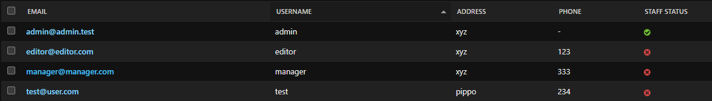
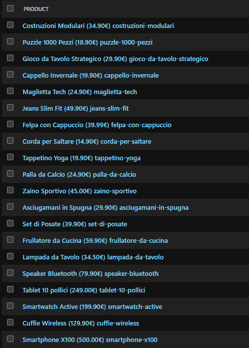
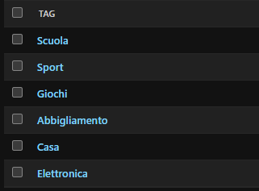
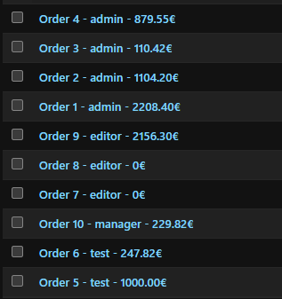
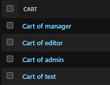

- [Informazioni Generali](#informazioni-generali)
- [Descrizione dell'applicazine](#descrizione-dellapplicazine)
  - [Features implementate](#features-implementate)
- [Database](#database)
  - [Demo Accounts](#demo-accounts)
- [Istruzioni per l'installazione in locale](#istruzioni-per-linstallazione-in-locale)
- [Link di deploy](#link-di-deploy)


# Informazioni Generali
| | |
|-|-|
| **Titolo del Progetto** | Progetto Back End Ecommerce |
| **Studente** | Matteo Sensi |
| **Progetto scelto** | Full Stack Web Ecommerce |
| **Framewok usato** | Django v5.2.14 |

# Descrizione dell'applicazine
L'applicazione in questione è un applicazione web che rappresenta un e-commerce di un negozio, questa quindi serve a permettere agli utenti di visualizzare i prodotti e successivamente acquistarli sul web.
## Features implementate
Nell'applicazione ci sono tre gruppi distinti che differenziano i tipi di utenti:
- **Customer**: Questo gruppo viene assegnato automaticamente quando un utente si registra al sito e come operazione principali puù fare:
  - Modificare i le proprie informazioni, compresa la password (per visualizzare l'email sul terminale di django occore usare la stessa email usata per la registrazione dell'utente)
  - Aggiungere i prodotti al carrello
  - Visualizzare il proprio carrello
  - Modificare gli elementi nel carrello (aggiungerli, diminuirli, eliminarli)
  - Eseguire l'ordine
  - Visualizzare i propri ordini (può anche filtrarli in funzione di cosa preferisce visualizzare)
  - Fare il logout
- **Editor**:
  - Eredita tutti i permessi di un Customer
  - Modificare le informazioni sui prodotti
  - Modificare le informazioni sulle categorie
- **Manager**:
  - Eredita tutti i permessi di un Editor
  - Eliminare un prodotto
  - Creare un prodotto
  - Eliminare una categoria
  - Creare una Categoria
  - Gestire gli ordini, il che implica poter vedere gli ordini di tutti gli utenti e modificare lo stato di un ordine. Per la visualizzazione sono disponibili i filtri

Questi ultimi due gruppi devono essere assegnati da un superuser ad un utente dalla pagina admin dell'applicazione.
Inoltre, chiunque acceda al sito, anche se non è registrato, ha le seguenti funzionalità:
- Visualizzare i prodotti del catalogo, con annessi filtri
- Visualizzare i dettagli di un singolo prodotto
- Visualizzare le categorie
- Procedere con l'accesso o la registrazione

Gli utenti Manager nella navbar avranno una sezione in più chiamata 'Manager' dove possono gestire gli ordini, aggiungere le categorie e i prodotti. Per modificare ed eliminare i prodotti invece si puù fare dalla pagina prodotti e dalla pagina del prodotto. Stessa cosa per le categorie nelle rispettive pagine.

# Database
Il database usato è quello di default di django ("db.sqlite3") e contiene le seguenti tabelle:

- **Cart**(id, user_id)
- **CartItem**(id, cart_id, product_id, quantity)
- **Order**(id, created_at, user_id, status, email_used, order_address)
- **Orderitem**(id, quantity, order_id, product_id, actual_price_per_unit)
- **Product**(id, name, description, price, stock, discount, slug)
- **product_categories**(id, product_id, tag_id)
- **Tag**(id, slug, name)
- **User**(id, password, last_login, is_superuser, username, first_name, last_name, is_staff, is_active, date_joined, address, phone, email)

In tutte le tabelle sono state usate le PK autogenerate da django.
Della tabella User (derivata dal modello AbstractUser) non sono state usate tutte le informazioni, first_name e last_name non sono state usate.

Il database è già stato popolato con prodotti, categorie, utenti, ordini e carrelli:
Utenti:




Prodotti:




Categorie:




Ordini:




Carrelli:


## Demo Accounts
Gli account già presenti nel database sono:

|Username | Password | email | Ruolo |
|-|-|-|-|
| admin | admin12345! | admin@admin.test | Manager + admin django |
| manager | man1234! | manager@manager.com| Manager |
| editor | edit1234! | editor@editor.com | Editor |
| test | test12345! | test@user.com | Customer |

# Istruzioni per l'installazione in locale
Installare l'applicazione in locale eseguire i seguenti script:
**È necessario aver installato python3**
Clona la repository in una cartella: 
```bash
git clone <repository-url>
cd <repository-folder>
```
Crea un virtual envirorment con Python:
```bash
python -m venv myenv
```
Attiva il virtual envirorment:
- Windows
```
.myenv\Scripts\activate
```
- Linux/MacOs:
```
source myenv/bin/activate
```
Installa le dipendenze:
```
pip install -r requirements.txt
```

Applica le migrazioni nel caso fosse necessario. Non dovrebbe essere necessario in quanto il db è già stato creato ed è nella repository.
```
python manage.py makemigrations
python manage.py migrate
```

Modifica la SECRET_KEY all'interno di settings.py impostandone una personale.

Avvia il server:
```
python manage.py runserver
```
Apri l'applicazione su un browser all'indirizzo http://127.0.0.1:8000/

# Link di deploy
Link per accedere al sito: https://progetto-back-end-ecommerce.onrender.com
